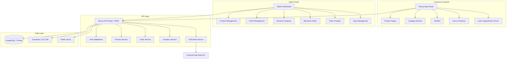
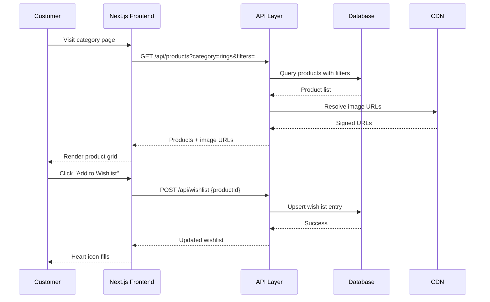
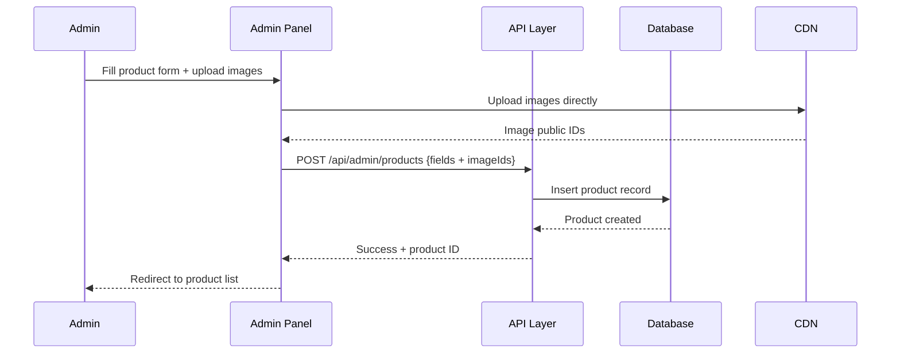
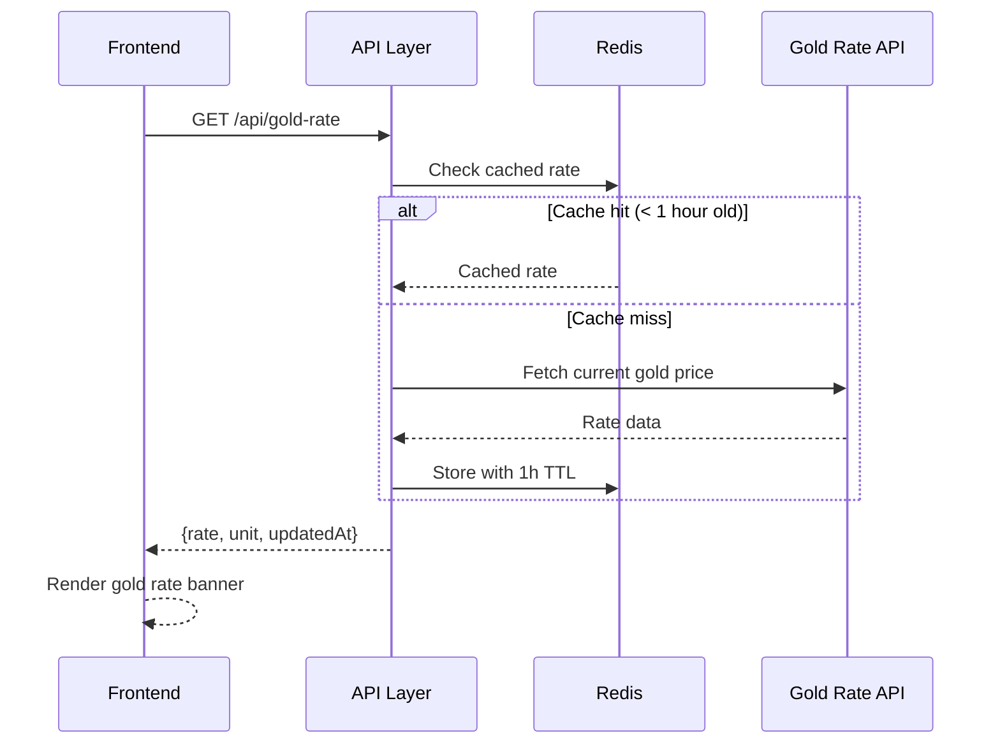

# Design Document: Jewelry Shop Ecommerce

## Overview

A full-featured luxury jewelry ecommerce platform built with Next.js, targeting both customers and shop administrators. The platform delivers an elegant, mobile-first shopping experience with category browsing, smart filtering, wishlist, live gold rates, and conversion-focused features — paired with a comprehensive admin panel for product, order, revenue, and merchant purchase management.

The system is designed around a luxury aesthetic (gold/cream/black palette), performance-first image delivery, and trust-building elements like BIS Hallmark badges and authenticity guarantees. The admin panel provides deep analytics including profit calculation, expense breakdown, and downloadable reports.

The architecture separates the customer-facing Next.js frontend from a RESTful API backend, with a relational database for structured product/order data and a CDN for media assets.

## Architecture



## Sequence Diagrams

### Customer: Browse & Add to Wishlist



### Admin: Add Product



### Gold Rate Display



## Components and Interfaces

### Component 1: Product Catalog

**Purpose**: Displays products in a grid/list with filtering, search, and category navigation.

**Interface**:
```pascal
INTERFACE ProductCatalog
  getProducts(filters: ProductFilters, pagination: Pagination): ProductListResult
  getProductById(id: UUID): Product
  searchProducts(query: String, filters: ProductFilters): ProductListResult
  getCategories(): Category[]
  getTypes(): JewelryType[]
END INTERFACE

INTERFACE ProductFilters
  category: String?          // rings, chains, pendants, etc.
  type: String?              // gold, silver
  priceMin: Number?
  priceMax: Number?
  weightMin: Number?
  weightMax: Number?
  occasion: String?          // wedding, daily-wear
  sortBy: SortOption?        // price-asc, price-desc, newest
END INTERFACE
```

**Responsibilities**:
- Serve paginated, filtered product lists
- Support full-text search across name and description
- Return optimized image URLs from CDN

### Component 2: Product Detail

**Purpose**: Full product page with image gallery, zoom, variants, and lead capture.

**Interface**:
```pascal
INTERFACE ProductDetail
  getProductDetail(id: UUID): ProductDetailResult
  getRelatedProducts(productId: UUID, limit: Number): Product[]
  submitPriceRequest(request: PriceRequest): LeadResult
  submitAppointment(booking: AppointmentBooking): BookingResult
END INTERFACE
```

**Responsibilities**:
- Serve full product data including all images and video URL
- Trigger lead capture for "Request Price" items
- Return related products by category/type

### Component 3: Wishlist

**Purpose**: Persisted wishlist for authenticated users; session-based for guests.

**Interface**:
```pascal
INTERFACE WishlistService
  getWishlist(userId: UUID?): WishlistItem[]
  addToWishlist(userId: UUID?, productId: UUID): WishlistResult
  removeFromWishlist(userId: UUID?, productId: UUID): WishlistResult
  mergeGuestWishlist(guestItems: UUID[], userId: UUID): WishlistResult
END INTERFACE
```

### Component 4: Gold Rate Service

**Purpose**: Fetches, caches, and serves current gold rate.

**Interface**:
```pascal
INTERFACE GoldRateService
  getCurrentRate(): GoldRate
  refreshRate(): GoldRate
  setManualRate(rate: Number, unit: String, adminId: UUID): GoldRate
END INTERFACE

STRUCTURE GoldRate
  ratePerGram: Number
  ratePerTola: Number
  purity: String        // 22K, 24K
  source: String        // "api" | "manual"
  updatedAt: DateTime
END STRUCTURE
```

### Component 5: Admin Product Management

**Purpose**: CRUD operations for products, types, and categories.

**Interface**:
```pascal
INTERFACE AdminProductService
  createProduct(data: ProductInput, adminId: UUID): Product
  updateProduct(id: UUID, data: ProductInput, adminId: UUID): Product
  deleteProduct(id: UUID, adminId: UUID): Boolean
  bulkUpdateStatus(ids: UUID[], status: ProductStatus): Number
END INTERFACE

INTERFACE AdminTypeService
  createType(name: String, category: String): JewelryType
  updateType(id: UUID, name: String): JewelryType
  deleteType(id: UUID): Boolean
END INTERFACE
```

### Component 6: Order Management

**Purpose**: Tracks customer orders and merchant purchase orders.

**Interface**:
```pascal
INTERFACE OrderService
  getOrders(filters: OrderFilters, pagination: Pagination): OrderListResult
  getOrderById(id: UUID): OrderDetail
  updateOrderStatus(id: UUID, status: OrderStatus, adminId: UUID): Order
  getOrderStats(): OrderStats
END INTERFACE

INTERFACE MerchantOrderService
  logMerchantOrder(data: MerchantOrderInput, adminId: UUID): MerchantOrder
  getMerchantOrders(filters: MerchantOrderFilters): MerchantOrder[]
  updateMerchantOrder(id: UUID, data: MerchantOrderInput): MerchantOrder
END INTERFACE
```

### Component 7: Analytics & Revenue

**Purpose**: Computes revenue, expenses, profit, and generates downloadable reports.

**Interface**:
```pascal
INTERFACE AnalyticsService
  getRevenueSummary(period: DateRange): RevenueSummary
  getDailyBreakdown(month: YearMonth): DailyRevenue[]
  getMonthlyBreakdown(year: Number): MonthlyRevenue[]
  getProfitReport(period: DateRange): ProfitReport
  exportOrdersCSV(filters: OrderFilters): FileBuffer
  exportRevenueCSV(period: DateRange): FileBuffer
END INTERFACE
```

## Data Models

### Product

```pascal
STRUCTURE Product
  id: UUID
  name: String                    // non-empty, max 200 chars
  slug: String                    // URL-safe, unique
  category: Enum(gold, silver)
  typeId: UUID                    // FK → JewelryType
  weight: Decimal                 // grams, > 0
  purity: String                  // e.g. "22K", "925"
  quantity: Integer               // >= 0
  images: ProductImage[]          // min 1 image
  videoUrl: String?               // optional short video
  description: String?
  purchasePrice: Decimal          // admin only
  salePrice: Decimal?             // null = "price on request"
  discountPrice: Decimal?
  makingCharges: Decimal
  occasion: String[]              // ["wedding", "daily-wear"]
  isFeatured: Boolean
  status: Enum(active, inactive, draft)
  createdAt: DateTime
  updatedAt: DateTime
END STRUCTURE

STRUCTURE ProductImage
  id: UUID
  productId: UUID
  publicId: String                // CDN public ID
  url: String
  isPrimary: Boolean
  sortOrder: Integer
END STRUCTURE
```

**Validation Rules**:
- `weight` must be > 0
- At least one image required
- `discountPrice` must be < `salePrice` if both present
- `slug` must be unique across all products

### JewelryType

```pascal
STRUCTURE JewelryType
  id: UUID
  name: String                    // e.g. "Pendant", "Ring"
  slug: String
  category: Enum(gold, silver, both)
  isActive: Boolean
  sortOrder: Integer
END STRUCTURE
```

### Order

```pascal
STRUCTURE Order
  id: UUID
  orderNumber: String             // human-readable, e.g. "ORD-2024-0001"
  customerId: UUID?               // null for guest
  customerName: String
  customerPhone: String
  customerEmail: String?
  items: OrderItem[]
  subtotal: Decimal
  shippingCost: Decimal
  gstAmount: Decimal
  gstRate: Decimal                // e.g. 0.03 for 3%
  totalAmount: Decimal
  status: Enum(pending, confirmed, processing, shipped, delivered, cancelled)
  notes: String?
  createdAt: DateTime
  updatedAt: DateTime
END STRUCTURE

STRUCTURE OrderItem
  id: UUID
  orderId: UUID
  productId: UUID
  productName: String             // snapshot at order time
  weight: Decimal
  quantity: Integer
  unitPrice: Decimal
  makingCharges: Decimal
  purchasePrice: Decimal          // for profit calculation
END STRUCTURE
```

### MerchantOrder

```pascal
STRUCTURE MerchantOrder
  id: UUID
  merchantName: String
  invoiceNumber: String?
  items: MerchantOrderItem[]
  totalWeight: Decimal            // grams
  totalCost: Decimal
  purity: String
  purchaseDate: Date
  notes: String?
  createdAt: DateTime
END STRUCTURE

STRUCTURE MerchantOrderItem
  id: UUID
  merchantOrderId: UUID
  description: String
  weight: Decimal
  ratePerGram: Decimal
  makingCharges: Decimal
  amount: Decimal
END STRUCTURE
```

### OtherCharges

```pascal
STRUCTURE OtherCharges
  id: UUID
  shippingCost: Decimal           // flat rate
  gstRate: Decimal                // e.g. 0.03
  otherChargesLabel: String?
  otherChargesAmount: Decimal
  updatedAt: DateTime
  updatedBy: UUID
END STRUCTURE
```

### Lead / Appointment

```pascal
STRUCTURE Lead
  id: UUID
  type: Enum(price_request, appointment, popup_offer)
  productId: UUID?
  name: String
  phone: String
  email: String?
  message: String?
  offerCode: String?
  status: Enum(new, contacted, converted, closed)
  createdAt: DateTime
END STRUCTURE
```

### Testimonial

```pascal
STRUCTURE Testimonial
  id: UUID
  customerName: String
  location: String?
  rating: Integer                 // 1-5
  content: String
  productId: UUID?
  imageUrl: String?
  isPublished: Boolean
  sortOrder: Integer
END STRUCTURE
```

## Algorithmic Pseudocode

### Product Listing with Filters

```pascal
ALGORITHM getFilteredProducts(filters, pagination)
INPUT: filters of type ProductFilters, pagination of type Pagination
OUTPUT: result of type ProductListResult

BEGIN
  ASSERT pagination.page >= 1
  ASSERT pagination.pageSize >= 1 AND pagination.pageSize <= 100

  query ← buildBaseQuery(status = "active")

  IF filters.category IS NOT NULL THEN
    query ← query.WHERE(category = filters.category)
  END IF

  IF filters.typeId IS NOT NULL THEN
    query ← query.WHERE(typeId = filters.typeId)
  END IF

  IF filters.priceMin IS NOT NULL THEN
    query ← query.WHERE(salePrice >= filters.priceMin)
  END IF

  IF filters.priceMax IS NOT NULL THEN
    query ← query.WHERE(salePrice <= filters.priceMax)
  END IF

  IF filters.weightMin IS NOT NULL THEN
    query ← query.WHERE(weight >= filters.weightMin)
  END IF

  IF filters.weightMax IS NOT NULL THEN
    query ← query.WHERE(weight <= filters.weightMax)
  END IF

  IF filters.occasion IS NOT NULL THEN
    query ← query.WHERE(occasion CONTAINS filters.occasion)
  END IF

  IF filters.query IS NOT NULL AND filters.query ≠ "" THEN
    query ← query.WHERE(name ILIKE "%" + filters.query + "%" OR description ILIKE "%" + filters.query + "%")
  END IF

  SWITCH filters.sortBy
    CASE "price-asc":  query ← query.ORDER_BY(salePrice ASC)
    CASE "price-desc": query ← query.ORDER_BY(salePrice DESC)
    CASE "weight-asc": query ← query.ORDER_BY(weight ASC)
    DEFAULT:           query ← query.ORDER_BY(createdAt DESC)
  END SWITCH

  total ← query.COUNT()
  offset ← (pagination.page - 1) * pagination.pageSize
  products ← query.LIMIT(pagination.pageSize).OFFSET(offset).FETCH()

  FOR each product IN products DO
    product.primaryImage ← resolveCDNUrl(product.images.WHERE(isPrimary = true).FIRST())
  END FOR

  RETURN {
    items: products,
    total: total,
    page: pagination.page,
    pageSize: pagination.pageSize,
    totalPages: CEIL(total / pagination.pageSize)
  }
END
```

**Preconditions**: pagination values are positive integers; filters are optional
**Postconditions**: returns only active products; total reflects unfiltered count for current filter set
**Loop Invariant**: all products in result have a resolved primary image URL

---

### Revenue & Profit Calculation

```pascal
ALGORITHM calculateProfitReport(dateRange)
INPUT: dateRange of type {startDate: Date, endDate: Date}
OUTPUT: report of type ProfitReport

BEGIN
  ASSERT dateRange.startDate <= dateRange.endDate

  deliveredOrders ← db.orders.WHERE(
    status = "delivered" AND
    createdAt BETWEEN dateRange.startDate AND dateRange.endDate
  ).FETCH()

  revenue ← 0
  purchaseCost ← 0
  totalShipping ← 0
  totalGST ← 0
  totalMakingCharges ← 0

  FOR each order IN deliveredOrders DO
    revenue ← revenue + order.totalAmount
    totalShipping ← totalShipping + order.shippingCost
    totalGST ← totalGST + order.gstAmount

    FOR each item IN order.items DO
      purchaseCost ← purchaseCost + (item.purchasePrice * item.quantity)
      totalMakingCharges ← totalMakingCharges + (item.makingCharges * item.quantity)
    END FOR
  END FOR

  totalExpenses ← purchaseCost + totalShipping + totalGST + totalMakingCharges
  grossProfit ← revenue - totalExpenses

  RETURN {
    period: dateRange,
    revenue: revenue,
    purchaseCost: purchaseCost,
    shippingExpenses: totalShipping,
    gstExpenses: totalGST,
    makingChargesExpenses: totalMakingCharges,
    totalExpenses: totalExpenses,
    grossProfit: grossProfit,
    profitMargin: IF revenue > 0 THEN (grossProfit / revenue) * 100 ELSE 0,
    orderCount: deliveredOrders.LENGTH()
  }
END
```

**Preconditions**: dateRange is valid; only delivered orders are counted
**Postconditions**: grossProfit = revenue - totalExpenses; profitMargin is percentage
**Loop Invariant**: running totals accumulate correctly across all orders and items

---

### Gold Rate Fetch with Cache

```pascal
ALGORITHM getCurrentGoldRate()
INPUT: none
OUTPUT: rate of type GoldRate

BEGIN
  cached ← redis.GET("gold_rate")

  IF cached IS NOT NULL THEN
    rate ← deserialize(cached)
    IF rate.updatedAt > NOW() - 1 HOUR THEN
      RETURN rate
    END IF
  END IF

  manualRate ← db.goldRates.WHERE(source = "manual").ORDER_BY(updatedAt DESC).FIRST()

  IF manualRate IS NOT NULL AND manualRate.updatedAt > NOW() - 24 HOURS THEN
    rate ← manualRate
  ELSE
    TRY
      apiResponse ← externalGoldAPI.fetch()
      rate ← mapApiResponse(apiResponse)
      rate.source ← "api"
      db.goldRates.UPSERT(rate)
    CATCH error
      IF manualRate IS NOT NULL THEN
        rate ← manualRate
      ELSE
        THROW GoldRateUnavailableError
      END IF
    END TRY
  END IF

  redis.SET("gold_rate", serialize(rate), TTL = 1 HOUR)
  RETURN rate
END
```

**Preconditions**: Redis and DB connections are available
**Postconditions**: returned rate is at most 1 hour stale; falls back to manual if API fails

---

### Exit Intent Popup Lead Capture

```pascal
ALGORITHM capturePopupLead(leadData)
INPUT: leadData of type {phone: String, email: String?, offerCode: String}
OUTPUT: result of type LeadResult

BEGIN
  ASSERT leadData.phone IS NOT NULL AND leadData.phone ≠ ""

  IF NOT isValidPhone(leadData.phone) THEN
    RETURN {success: false, error: "Invalid phone number"}
  END IF

  existingLead ← db.leads.WHERE(phone = leadData.phone AND type = "popup_offer").FIRST()

  IF existingLead IS NOT NULL THEN
    RETURN {success: false, error: "Offer already claimed for this number"}
  END IF

  lead ← db.leads.INSERT({
    type: "popup_offer",
    phone: leadData.phone,
    email: leadData.email,
    offerCode: leadData.offerCode,
    status: "new",
    createdAt: NOW()
  })

  sendWhatsAppOrSMS(leadData.phone, "Your 5% off code: " + leadData.offerCode)

  RETURN {success: true, leadId: lead.id, offerCode: leadData.offerCode}
END
```

**Preconditions**: phone is non-empty; offerCode is pre-generated
**Postconditions**: lead is persisted; notification sent; duplicate phone rejected

---

### Admin: Create Product

```pascal
ALGORITHM createProduct(input, adminId)
INPUT: input of type ProductInput, adminId of type UUID
OUTPUT: product of type Product

BEGIN
  ASSERT input.name IS NOT NULL AND input.name ≠ ""
  ASSERT input.weight > 0
  ASSERT input.images.LENGTH() >= 1
  ASSERT input.typeId IS NOT NULL

  IF input.discountPrice IS NOT NULL AND input.salePrice IS NOT NULL THEN
    ASSERT input.discountPrice < input.salePrice
  END IF

  slug ← generateSlug(input.name)
  existingSlug ← db.products.WHERE(slug = slug).FIRST()

  IF existingSlug IS NOT NULL THEN
    slug ← slug + "-" + generateShortId()
  END IF

  product ← db.products.INSERT({
    ...input,
    slug: slug,
    status: "active",
    createdAt: NOW(),
    updatedAt: NOW()
  })

  FOR each imageId IN input.imageIds DO
    isPrimary ← (imageId = input.imageIds[0])
    db.productImages.INSERT({
      productId: product.id,
      publicId: imageId,
      url: buildCDNUrl(imageId),
      isPrimary: isPrimary,
      sortOrder: input.imageIds.INDEX_OF(imageId)
    })
  END FOR

  db.auditLog.INSERT({action: "product_created", entityId: product.id, adminId: adminId})

  RETURN product
END
```

**Preconditions**: admin is authenticated; type exists; at least one image uploaded to CDN
**Postconditions**: product is persisted with unique slug; images linked; audit log entry created
**Loop Invariant**: each image is correctly linked to the product with correct sort order

## Key Functions with Formal Specifications

### `getFilteredProducts(filters, pagination)`

```pascal
FUNCTION getFilteredProducts(filters: ProductFilters, pagination: Pagination): ProductListResult
```

**Preconditions:**
- `pagination.page >= 1`
- `pagination.pageSize` is between 1 and 100
- If `filters.priceMin` and `filters.priceMax` both set: `priceMin <= priceMax`
- If `filters.weightMin` and `filters.weightMax` both set: `weightMin <= weightMax`

**Postconditions:**
- All returned products have `status = "active"`
- `result.total` equals count of all matching products (before pagination)
- `result.items.length <= pagination.pageSize`
- Each product has a resolved `primaryImage.url`

---

### `calculateProfitReport(dateRange)`

```pascal
FUNCTION calculateProfitReport(dateRange: DateRange): ProfitReport
```

**Preconditions:**
- `dateRange.startDate <= dateRange.endDate`
- Both dates are valid calendar dates

**Postconditions:**
- `report.grossProfit = report.revenue - report.totalExpenses`
- `report.totalExpenses = purchaseCost + shippingExpenses + gstExpenses + makingChargesExpenses`
- `report.profitMargin = (grossProfit / revenue) * 100` when `revenue > 0`, else `0`
- Only orders with `status = "delivered"` are included

---

### `addToWishlist(userId, productId)`

```pascal
FUNCTION addToWishlist(userId: UUID?, productId: UUID): WishlistResult
```

**Preconditions:**
- `productId` refers to an existing, active product
- If `userId` is null, session-based storage is used

**Postconditions:**
- Product appears exactly once in the wishlist (idempotent)
- Returns updated wishlist item count

---

### `updateOrderStatus(orderId, newStatus, adminId)`

```pascal
FUNCTION updateOrderStatus(orderId: UUID, newStatus: OrderStatus, adminId: UUID): Order
```

**Preconditions:**
- Order with `orderId` exists
- `newStatus` is a valid `OrderStatus` enum value
- Status transition is valid (see transition rules below)

**Valid Status Transitions:**
```pascal
pending     → confirmed | cancelled
confirmed   → processing | cancelled
processing  → shipped
shipped     → delivered
```

**Postconditions:**
- Order `status` is updated to `newStatus`
- `updatedAt` is set to current timestamp
- Audit log entry is created

---

### `setManualGoldRate(rate, unit, adminId)`

```pascal
FUNCTION setManualGoldRate(rate: Number, unit: String, adminId: UUID): GoldRate
```

**Preconditions:**
- `rate > 0`
- `unit` is one of: "per_gram_22k", "per_gram_24k", "per_tola_22k", "per_tola_24k"
- `adminId` is authenticated admin

**Postconditions:**
- New gold rate record persisted with `source = "manual"`
- Redis cache invalidated
- Next call to `getCurrentGoldRate()` returns this rate

## Example Usage

### Customer: Filter Products by Category and Price

```pascal
SEQUENCE
  filters ← {
    category: "gold",
    typeId: "rings-type-uuid",
    priceMin: 5000,
    priceMax: 50000,
    occasion: "wedding",
    sortBy: "price-asc"
  }
  pagination ← {page: 1, pageSize: 20}

  result ← getFilteredProducts(filters, pagination)

  IF result.total = 0 THEN
    DISPLAY "No products found. Try adjusting filters."
  ELSE
    DISPLAY result.items AS product grid
    DISPLAY pagination controls WITH result.totalPages
  END IF
END SEQUENCE
```

### Admin: Monthly Revenue Report

```pascal
SEQUENCE
  dateRange ← {
    startDate: firstDayOfMonth(currentMonth),
    endDate: lastDayOfMonth(currentMonth)
  }

  report ← calculateProfitReport(dateRange)

  DISPLAY dashboard cards:
    - "Revenue: ₹" + report.revenue
    - "Investment: ₹" + report.purchaseCost
    - "Expenses: ₹" + report.totalExpenses
    - "Profit: ₹" + report.grossProfit
    - "Margin: " + report.profitMargin + "%"

  IF adminRequestsExport THEN
    csv ← exportRevenueCSV(dateRange)
    TRIGGER download(csv, "revenue-" + currentMonth + ".csv")
  END IF
END SEQUENCE
```

### Customer: Request Price for High-Ticket Item

```pascal
SEQUENCE
  product ← getProductById(productId)

  IF product.salePrice IS NULL THEN
    DISPLAY "Price on Request" button
    ON button click:
      SHOW lead form {name, phone, message}
      ON form submit:
        result ← submitPriceRequest({
          productId: product.id,
          name: formData.name,
          phone: formData.phone,
          message: formData.message
        })
        DISPLAY "Thank you! We'll contact you within 24 hours."
  END IF
END SEQUENCE
```

## Correctness Properties

*A property is a characteristic or behavior that should hold true across all valid executions of a system — essentially, a formal statement about what the system should do. Properties serve as the bridge between human-readable specifications and machine-verifiable correctness guarantees.*

### Property 1: Active Product Visibility

*For any* product P, P is returned in customer-facing product listing queries if and only if P.status = "active". Products with any other status must never appear in customer-facing results.

**Validates: Requirements 1.1, 1.7**

---

### Property 2: Filter Correctness — Type

*For any* set of products and any type filter value, all products returned by the catalog must have a typeId matching the specified filter.

**Validates: Requirements 1.2**

---

### Property 3: Filter Correctness — Price Range

*For any* set of products and any valid price range [priceMin, priceMax], all returned products must have a salePrice within that range (inclusive).

**Validates: Requirements 1.3, 3.2**

---

### Property 4: Filter Correctness — Weight Range

*For any* set of products and any valid weight range [weightMin, weightMax], all returned products must have a weight within that range (inclusive).

**Validates: Requirements 1.4, 3.3**

---

### Property 5: Filter Correctness — Occasion

*For any* set of products and any occasion filter value, all returned products must have the specified occasion present in their occasion array.

**Validates: Requirements 1.5**

---

### Property 6: Sort Correctness

*For any* product listing result with a sort option applied, the items array must be ordered according to the selected criterion (price ascending, price descending, or newest first by createdAt).

**Validates: Requirements 1.6**

---

### Property 7: Search Correctness

*For any* search query string Q and any product set, all returned products must have Q appearing in their name or description (case-insensitive), and no product whose name and description both lack Q may appear in the results.

**Validates: Requirements 1.8**

---

### Property 8: Primary Image URL Present

*For any* product listing response, every product in the items array must have a non-null, non-empty primaryImage.url resolved from the CDN.

**Validates: Requirements 1.9, 17.4**

---

### Property 9: Pagination Bounds

*For any* valid pagination input with pageSize P, the returned items array must have length ≤ P, and the response must include total, page, pageSize, and totalPages fields.

**Validates: Requirements 1.10**

---

### Property 10: Filter Composition — Monotonicity

*For any* product set, applying a strict superset of filters must return a result set that is a subset of (or equal to) the result set returned by the subset of filters. Adding more filters never increases the result count.

**Validates: Requirements 3.1**

---

### Property 11: purchasePrice Exclusion from Customer Responses

*For any* customer-facing API response (product listing, product detail, related products), the purchasePrice field must be absent from every product object in the response.

**Validates: Requirements 2.8**

---

### Property 12: Related Products Bounded and Categorized

*For any* product P and any requested limit L, the related products response must contain at most L items, and every returned product must share the same category or typeId as P.

**Validates: Requirements 2.6**

---

### Property 13: Wishlist Add Round-Trip

*For any* user (authenticated or guest) and any active product P, after adding P to the wishlist, querying the wishlist must return a result that includes P.

**Validates: Requirements 4.1, 4.2**

---

### Property 14: Wishlist Idempotency

*For any* user U and product P, adding P to U's wishlist N times (N ≥ 1) results in exactly one wishlist entry for P.

**Validates: Requirements 4.3**

---

### Property 15: Wishlist Remove Round-Trip

*For any* user U and product P that is in U's wishlist, after removing P, querying the wishlist must return a result that does not include P.

**Validates: Requirements 4.4**

---

### Property 16: Wishlist Merge Completeness

*For any* guest session wishlist G and authenticated user U, after merging G into U's wishlist, every product that was in G must appear in U's wishlist.

**Validates: Requirements 4.5**

---

### Property 17: Gold Rate Cache Freshness

*For any* gold rate cached with a timestamp less than 1 hour ago, the GoldRateService must return that cached rate without invoking the external API.

**Validates: Requirements 5.2, 18.3**

---

### Property 18: Manual Gold Rate Validation

*For any* manual gold rate submission, the system must reject rate values ≤ 0 and must reject unit values not in the set {per_gram_22k, per_gram_24k, per_tola_22k, per_tola_24k}.

**Validates: Requirements 5.7, 17.5**

---

### Property 19: Lead Creation Correctness

*For any* valid lead submission (price request or appointment), a Lead record must be persisted with the correct type, the submitting customer's phone, and (if provided) the associated productId.

**Validates: Requirements 6.1, 6.2**

---

### Property 20: Lead Deduplication

*For any* phone number, there must be at most one Lead record with type = "popup_offer" associated with that phone number.

**Validates: Requirements 6.4**

---

### Property 21: Invalid Phone Rejection

*For any* lead submission containing a phone number that fails phone format validation, the system must return an error and must not persist a Lead record.

**Validates: Requirements 6.5**

---

### Property 22: Testimonials — Published Only

*For any* call to the testimonials endpoint, all returned testimonials must have isPublished = true. No unpublished testimonial may appear in the response.

**Validates: Requirements 7.2**

---

### Property 23: Admin Role Enforcement

*For any* request to an admin API route made by an authenticated user whose role is not "admin", the system must return HTTP 403 and must not execute the requested mutation or query.

**Validates: Requirements 9.2, 9.3**

---

### Property 24: Product Creation Field Completeness

*For any* successful product creation, the persisted product record must contain all required fields: name, category, typeId, weight, purity, quantity, at least one image, purchasePrice, and makingCharges.

**Validates: Requirements 10.1**

---

### Property 25: Slug URL-Safety and Uniqueness

*For any* two distinct products P1 and P2, P1.slug ≠ P2.slug. Additionally, for any product name, the generated slug must be URL-safe (no spaces or special characters other than hyphens).

**Validates: Requirements 10.2, 17.3**

---

### Property 26: Price Integrity — Discount Below Sale

*For any* product with both salePrice and discountPrice set, discountPrice must be strictly less than salePrice. Any product creation or update violating this must be rejected.

**Validates: Requirements 10.4**

---

### Property 27: Product Deletion Cascade

*For any* product P that has been deleted, neither P nor any of P's associated ProductImage records must be retrievable via any API endpoint.

**Validates: Requirements 10.6**

---

### Property 28: Audit Log Completeness

*For any* admin mutation M (product create/update/delete, order status update), an audit log entry must exist containing M's action type, the affected entity ID, the admin ID, and a timestamp.

**Validates: Requirements 10.7, 12.5**

---

### Property 29: Image Upload Validation

*For any* image upload where the file exceeds 10MB or has an invalid MIME type, the system must reject the upload and must not persist the associated product record.

**Validates: Requirements 10.8**

---

### Property 30: Bulk Update Count Accuracy

*For any* bulk status update operation targeting N product IDs, the returned count must equal the number of products whose status was actually changed.

**Validates: Requirements 10.10**

---

### Property 31: Active Types Returned

*For any* call to the customer-facing getTypes endpoint, all returned JewelryType records must have isActive = true. No inactive type may appear in the response.

**Validates: Requirements 11.4**

---

### Property 32: Order Filter Correctness

*For any* order list query with status and/or date range filters applied, all returned orders must match the specified filter criteria.

**Validates: Requirements 12.1**

---

### Property 33: Order Status Transition Validity

*For any* order status update, the system must only permit transitions defined in the state machine: pending → confirmed | cancelled, confirmed → processing | cancelled, processing → shipped, shipped → delivered. Any other transition must be rejected with HTTP 400.

**Validates: Requirements 12.3, 12.4**

---

### Property 34: Order Stats Accuracy

*For any* call to the order stats endpoint, the count for each status must equal the actual number of orders in the database with that status.

**Validates: Requirements 12.6**

---

### Property 35: Order Total Calculation

*For any* order, totalAmount must equal subtotal + shippingCost + gstAmount, and gstAmount must equal subtotal × gstRate.

**Validates: Requirements 13.2, 13.3, 17.7**

---

### Property 36: Profit Calculation Identity

*For any* date range D and set of delivered orders within D:
- report(D).grossProfit = report(D).revenue − report(D).totalExpenses
- report(D).totalExpenses = purchaseCost + shippingExpenses + gstExpenses + makingChargesExpenses
- When revenue > 0: report(D).profitMargin = (grossProfit / revenue) × 100
- When revenue = 0: report(D).profitMargin = 0

**Validates: Requirements 14.2, 14.3, 14.4, 14.5**

---

### Property 37: Delivered-Only Revenue Inclusion

*For any* revenue or profit report, only orders with status = "delivered" must contribute to revenue, purchaseCost, and expense totals. Orders with any other status must be excluded.

**Validates: Requirements 14.6**

---

### Property 38: CSV Export Round-Trip

*For any* orders CSV export with filters F, parsing the exported CSV must yield a set of order records that matches the set of orders returned by the orders list API with the same filters F.

**Validates: Requirements 15.1, 15.2**

---

### Property 39: Merchant Order Item Amount Calculation

*For any* MerchantOrderItem, the amount field must equal (weight × ratePerGram) + makingCharges.

**Validates: Requirements 16.4**

---

### Property 40: Product Weight Validation

*For any* product creation or update, the system must reject weight values ≤ 0.

**Validates: Requirements 17.1**

---

### Property 41: Product Image Requirement

*For any* product creation or update, the system must reject requests where the images array is empty.

**Validates: Requirements 17.2**

## Error Handling

### Error Scenario 1: Product Not Found

**Condition**: Client requests a product by ID or slug that doesn't exist or is inactive
**Response**: HTTP 404 with `{error: "Product not found"}`
**Recovery**: Frontend shows "Product unavailable" page with related products

### Error Scenario 2: Gold Rate API Failure

**Condition**: External gold rate API is unreachable or returns invalid data
**Response**: Fall back to most recent manual rate; if none exists, return cached stale rate with `stale: true` flag
**Recovery**: Admin is notified via dashboard warning; manual rate entry is prompted

### Error Scenario 3: Image Upload Failure

**Condition**: CDN upload fails during product creation/edit
**Response**: HTTP 422 with `{error: "Image upload failed", details: ...}`
**Recovery**: Product is not saved; admin retries upload; partial uploads are cleaned up

### Error Scenario 4: Duplicate Lead Phone

**Condition**: User submits popup offer form with a phone number already in the system
**Response**: Silent success on frontend (don't reveal data); internally mark as duplicate
**Recovery**: No new lead created; no offer code sent again

### Error Scenario 5: Invalid Order Status Transition

**Condition**: Admin attempts an invalid status transition (e.g., shipped → pending)
**Response**: HTTP 400 with `{error: "Invalid status transition", from: "shipped", to: "pending"}`
**Recovery**: Admin panel shows current valid transitions for the order

### Error Scenario 6: Concurrent Wishlist Update

**Condition**: Same user adds/removes wishlist item from multiple devices simultaneously
**Response**: Use database upsert/delete with idempotency; last write wins
**Recovery**: Wishlist is eventually consistent; no duplicate entries

## Testing Strategy

### Unit Testing Approach

Test pure business logic functions in isolation:
- `calculateProfitReport` with known order fixtures
- `getFilteredProducts` filter-building logic
- `generateSlug` uniqueness and URL-safety
- Status transition validation logic
- Gold rate cache invalidation logic

### Property-Based Testing Approach

**Property Test Library**: fast-check

Key properties to test:
- Profit calculation: `grossProfit = revenue - totalExpenses` holds for any set of orders
- Filter composition: applying filters never returns more results than applying fewer filters
- Slug generation: generated slugs are always URL-safe (no spaces, special chars)
- Pagination: `items.length <= pageSize` for any valid pagination input
- Wishlist idempotency: adding same product N times results in exactly 1 entry

### Integration Testing Approach

- API route tests using supertest against a test database
- Product CRUD lifecycle: create → read → update → delete
- Order status transition flow: pending → confirmed → processing → shipped → delivered
- Gold rate: API fetch → cache → serve → cache expiry → re-fetch
- Lead capture: submit → deduplicate → notify

## Performance Considerations

- Product images served via CDN with responsive srcset (WebP format, multiple sizes)
- Product list pages use ISR (Incremental Static Regeneration) with 5-minute revalidation
- Gold rate cached in Redis with 1-hour TTL
- Database indexes on: `products(status, category, typeId)`, `products(slug)`, `orders(status, createdAt)`, `leads(phone, type)`
- Infinite scroll / cursor-based pagination for product grids on mobile
- Video assets use lazy loading and autoplay only when in viewport

## Security Considerations

- Admin routes protected by JWT-based session with role check (`role = "admin"`)
- All admin mutations validated server-side (never trust client input)
- `purchasePrice` field excluded from all customer-facing API responses
- Phone numbers stored hashed for lead deduplication; plain text only in admin view
- Image uploads validated for MIME type and file size (max 10MB per image)
- Rate limiting on lead capture endpoints (max 3 submissions per IP per hour)
- CSRF protection on all form submissions
- Environment variables for CDN keys, DB credentials, gold rate API key

## Dependencies

- **Next.js 14+** — App Router, ISR, API Routes
- **Prisma** — ORM for PostgreSQL
- **PostgreSQL** — Primary database
- **Redis** — Gold rate caching, session store
- **Cloudinary** — Image/video CDN and transformation
- **Tailwind CSS** — Styling with luxury theme tokens
- **Framer Motion** — Smooth animations and transitions
- **React Query / TanStack Query** — Client-side data fetching and caching
- **Zod** — Schema validation for API inputs
- **NextAuth.js** — Admin authentication
- **fast-check** — Property-based testing
- **Recharts** — Revenue/analytics charts in admin panel
- **react-image-magnify** — Product image zoom on hover
- **Papa Parse** — CSV export for reports
